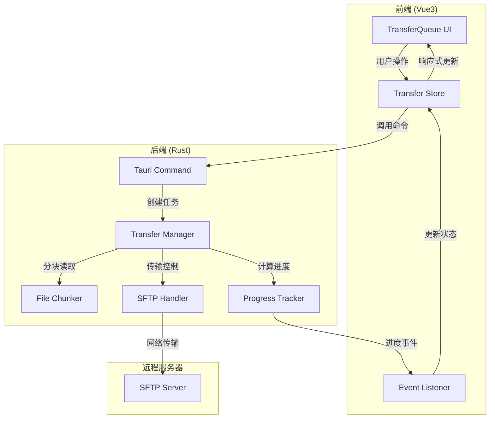
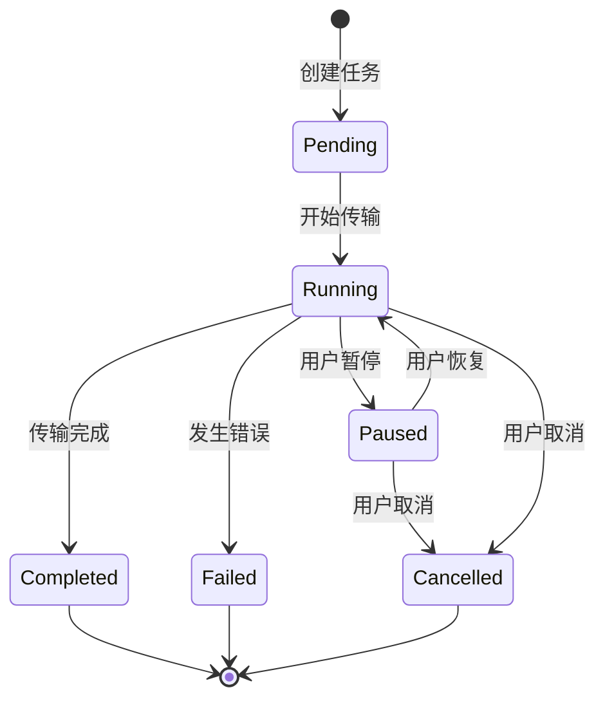
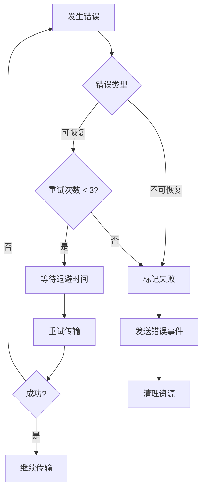

# 设计文档：文件传输实时进度优化

## 概述

本设计文档描述了 DevForge 文件传输功能的优化方案，主要解决当前系统无法显示实时传输进度的问题。

### 当前问题

1. **小文件瞬间完成**：文件在用户看到进度之前就已完成传输
2. **大文件无实时进度**：一次性读取整个文件到内存再上传，无法显示中间进度
3. **缺少传输控制**：无法暂停、恢复或取消正在进行的传输

### 解决方案概要

采用**分块传输**策略：
- 将文件分割成固定大小的块（默认 1MB）
- 逐块读取、传输、发送进度事件
- 使用滑动窗口算法计算实时速度
- 实现传输状态机支持暂停/恢复/取消

### 技术栈

- **后端**: Rust + Tauri + ssh2 (SFTP)
- **前端**: Vue3 + TypeScript + Pinia
- **事件通信**: Tauri Event System

## 架构

### 系统架构图



### 分层架构

1. **表现层 (Presentation Layer)**
   - TransferQueue.vue: 传输队列 UI 组件
   - Progress.vue: 进度条组件
   - 负责显示传输状态和用户交互

2. **状态管理层 (State Management Layer)**
   - Transfer Store: 管理所有传输任务状态
   - 监听后端事件并更新 UI
   - 提供任务操作接口

3. **命令层 (Command Layer)**
   - Tauri Commands: 暴露给前端的 API
   - 参数验证和错误处理
   - 调用传输管理器

4. **业务逻辑层 (Business Logic Layer)**
   - Transfer Manager: 传输任务管理
   - File Chunker: 文件分块逻辑
   - Progress Tracker: 进度跟踪和速度计算

5. **传输层 (Transport Layer)**
   - SFTP Handler: 实际的文件传输操作
   - 连接管理和错误处理

## 组件和接口

### 1. File Chunker (文件分块器)

**职责**: 将文件分割成固定大小的块，支持顺序读取

**接口**:
```rust
struct FileChunker {
    file_path: PathBuf,
    chunk_size: usize,
    total_size: u64,
    current_offset: u64,
}

impl FileChunker {
    // 创建新的分块器
    fn new(file_path: PathBuf, chunk_size: usize) -> Result<Self>;
    
    // 读取下一个块
    fn read_next_chunk(&mut self) -> Result<Option<Vec<u8>>>;
    
    // 获取当前进度
    fn progress(&self) -> (u64, u64); // (已读取, 总大小)
    
    // 重置到指定位置（用于恢复传输）
    fn seek(&mut self, offset: u64) -> Result<()>;
}
```

**实现细节**:
- 使用 `std::fs::File` 和 `std::io::Read`
- 默认块大小: 1MB (1048576 字节)
- 支持配置块大小范围: 64KB - 10MB
- 小文件（< chunk_size）作为单块处理

### 2. Transfer Manager (传输管理器)

**职责**: 管理所有传输任务的生命周期和状态

**接口**:
```rust
struct TransferManager {
    active_tasks: Arc<Mutex<HashMap<String, TransferTask>>>,
    config: TransferConfig,
}

struct TransferTask {
    id: String,
    task_type: TransferType,
    state: Arc<Mutex<TransferState>>,
    cancel_token: CancellationToken,
}

enum TransferType {
    Upload { local_path: PathBuf, remote_path: String },
    Download { remote_path: String, local_path: PathBuf },
}

enum TransferState {
    Pending,
    Running { offset: u64 },
    Paused { offset: u64 },
    Completed,
    Failed { error: String },
}

impl TransferManager {
    // 创建上传任务
    fn start_upload(
        &self,
        id: String,
        local_path: PathBuf,
        remote_path: String,
        sftp: Arc<Sftp>,
    ) -> Result<()>;
    
    // 创建下载任务
    fn start_download(
        &self,
        id: String,
        remote_path: String,
        local_path: PathBuf,
        sftp: Arc<Sftp>,
    ) -> Result<()>;
    
    // 暂停任务
    fn pause_task(&self, id: &str) -> Result<()>;
    
    // 恢复任务
    fn resume_task(&self, id: &str) -> Result<()>;
    
    // 取消任务
    fn cancel_task(&self, id: &str) -> Result<()>;
}
```

**实现细节**:
- 使用 `tokio` 异步运行时
- 每个任务在独立的 tokio task 中运行
- 使用 `CancellationToken` 实现取消机制
- 使用 `Arc<Mutex<>>` 实现线程安全的状态共享

### 3. Progress Tracker (进度跟踪器)

**职责**: 跟踪传输进度，计算速度和剩余时间

**接口**:
```rust
struct ProgressTracker {
    task_id: String,
    total_bytes: u64,
    transferred_bytes: AtomicU64,
    speed_window: Arc<Mutex<VecDeque<SpeedSample>>>,
    last_emit_time: Arc<Mutex<Instant>>,
    emit_interval: Duration,
}

struct SpeedSample {
    timestamp: Instant,
    bytes: u64,
}

impl ProgressTracker {
    // 创建新的进度跟踪器
    fn new(task_id: String, total_bytes: u64, emit_interval: Duration) -> Self;
    
    // 更新已传输字节数
    fn update(&self, bytes: u64) -> Result<()>;
    
    // 计算当前速度（字节/秒）
    fn calculate_speed(&self) -> u64;
    
    // 发送进度事件（带节流）
    fn emit_progress(&self, app_handle: &AppHandle) -> Result<()>;
    
    // 强制发送进度事件（忽略节流）
    fn emit_progress_force(&self, app_handle: &AppHandle) -> Result<()>;
}
```

**实现细节**:
- 使用滑动窗口算法计算速度（默认 3 秒窗口）
- 进度事件节流：最多每 100ms 发送一次
- 使用 `AtomicU64` 实现无锁的字节计数
- 速度样本存储在 `VecDeque` 中，自动清理过期样本

### 4. SFTP Handler (SFTP 处理器)

**职责**: 执行实际的 SFTP 上传和下载操作

**接口**:
```rust
struct SftpHandler {
    sftp: Arc<Sftp>,
}

impl SftpHandler {
    // 分块上传文件
    async fn upload_chunked(
        &self,
        local_path: PathBuf,
        remote_path: String,
        chunk_size: usize,
        progress_tracker: Arc<ProgressTracker>,
        cancel_token: CancellationToken,
    ) -> Result<()>;
    
    // 分块下载文件
    async fn download_chunked(
        &self,
        remote_path: String,
        local_path: PathBuf,
        chunk_size: usize,
        progress_tracker: Arc<ProgressTracker>,
        cancel_token: CancellationToken,
    ) -> Result<()>;
    
    // 从指定偏移量恢复上传
    async fn resume_upload(
        &self,
        local_path: PathBuf,
        remote_path: String,
        offset: u64,
        chunk_size: usize,
        progress_tracker: Arc<ProgressTracker>,
        cancel_token: CancellationToken,
    ) -> Result<()>;
    
    // 从指定偏移量恢复下载
    async fn resume_download(
        &self,
        remote_path: String,
        local_path: PathBuf,
        offset: u64,
        chunk_size: usize,
        progress_tracker: Arc<ProgressTracker>,
        cancel_token: CancellationToken,
    ) -> Result<()>;
}
```

**实现细节**:
- 使用 `ssh2::Sftp` 进行文件操作
- 上传：使用 `sftp.open_mode()` 打开远程文件，逐块写入
- 下载：使用 `sftp.open()` 读取远程文件，逐块写入本地
- 支持断点续传：使用 `seek()` 定位到指定偏移量
- 每块传输后检查 `cancel_token` 状态

### 5. Tauri Commands (命令接口)

**职责**: 暴露给前端的 API 接口

**接口**:
```rust
// 开始上传
#[tauri::command]
async fn start_upload(
    id: String,
    local_path: String,
    remote_path: String,
    connection_id: String,
    state: State<'_, AppState>,
) -> Result<(), String>;

// 开始下载
#[tauri::command]
async fn start_download(
    id: String,
    remote_path: String,
    local_path: String,
    connection_id: String,
    state: State<'_, AppState>,
) -> Result<(), String>;

// 暂停传输
#[tauri::command]
async fn pause_transfer(
    id: String,
    state: State<'_, AppState>,
) -> Result<(), String>;

// 恢复传输
#[tauri::command]
async fn resume_transfer(
    id: String,
    state: State<'_, AppState>,
) -> Result<(), String>;

// 取消传输
#[tauri::command]
async fn cancel_transfer(
    id: String,
    state: State<'_, AppState>,
) -> Result<(), String>;
```

### 6. Transfer Store (前端状态管理)

**职责**: 管理前端传输任务状态，监听后端事件

**接口** (保持现有接口不变，扩展功能):
```typescript
export interface TransferTask {
  id: string
  type: 'upload' | 'download'
  fileName: string
  localPath: string
  remotePath: string
  totalBytes: number
  transferredBytes: number
  speed: number
  status: 'pending' | 'transferring' | 'completed' | 'error' | 'paused'
  error?: string
  startTime?: number
  endTime?: number
  // 新增字段
  canPause?: boolean
  canResume?: boolean
  canCancel?: boolean
}

export const useTransferStore = defineStore('transfer', () => {
  // 现有方法保持不变
  // ...
  
  // 新增方法
  async function pauseTask(id: string): Promise<void>
  async function resumeTask(id: string): Promise<void>
  async function cancelTask(id: string): Promise<void>
})
```

## 数据模型

### 传输配置

```rust
struct TransferConfig {
    // 分块大小（字节）
    chunk_size: usize,
    
    // 进度事件发送间隔（毫秒）
    progress_emit_interval: u64,
    
    // 速度计算窗口大小（秒）
    speed_window_size: u64,
    
    // 最大并发传输任务数
    max_concurrent_tasks: usize,
    
    // 小文件最小显示时间（毫秒）
    min_display_time_for_small_files: u64,
}

impl Default for TransferConfig {
    fn default() -> Self {
        Self {
            chunk_size: 1024 * 1024, // 1MB
            progress_emit_interval: 100, // 100ms
            speed_window_size: 3, // 3秒
            max_concurrent_tasks: 3,
            min_display_time_for_small_files: 200, // 200ms
        }
    }
}
```

### 进度事件

```rust
#[derive(Serialize, Clone)]
struct ProgressEvent {
    id: String,
    transferred: u64,
    total: u64,
    speed: u64, // bytes per second
}

#[derive(Serialize, Clone)]
struct CompleteEvent {
    id: String,
}

#[derive(Serialize, Clone)]
struct ErrorEvent {
    id: String,
    error: String,
}
```

### 传输状态机



## 正确性属性

*属性是一个特征或行为，应该在系统的所有有效执行中保持为真——本质上是关于系统应该做什么的形式化陈述。属性作为人类可读规范和机器可验证正确性保证之间的桥梁。*


### 属性反思

在编写正确性属性之前，我需要识别并消除冗余的属性：

**识别的冗余：**

1. **上传和下载的对称性**：
   - 属性 2.1-2.5（上传）和 3.1-3.5（下载）本质上是相同的逻辑，只是方向不同
   - 可以合并为通用的"分块传输"属性

2. **进度事件的重复**：
   - 属性 2.2（上传进度事件）、3.3（下载进度事件）和 4.2（进度事件结构）可以合并
   - 统一为"进度事件完整性"属性

3. **状态转换的重复**：
   - 属性 6.2（暂停状态）、6.4（恢复状态）、7.3（取消状态）都是状态转换
   - 可以合并为"状态机转换正确性"属性

4. **格式化函数的重复**：
   - 属性 5.3（速度格式化）和 5.4（时间格式化）都是格式化函数
   - 可以合并为"人类可读格式化"属性

5. **配置加载的重复**：
   - 属性 10.1-10.4 都是配置项的具体例子
   - 可以合并为一个"配置加载"属性

**保留的核心属性：**

经过反思，我将保留以下核心属性，每个属性提供独特的验证价值：

1. 文件分块往返一致性（合并 1.1, 1.4）
2. 分块传输完整性（合并 2.1, 2.3, 3.1, 3.4）
3. 进度事件完整性（合并 2.2, 3.3, 4.2, 4.3）
4. 进度事件节流（4.5）
5. 速度计算正确性（4.1, 5.1, 5.2）
6. 人类可读格式化（合并 5.3, 5.4）
7. 暂停和恢复一致性（合并 6.1, 6.3, 6.5）
8. 状态机转换正确性（合并 6.2, 6.4, 7.3, 9.3）
9. 取消操作清理（合并 7.1, 7.2, 7.4, 7.5）
10. 错误处理完整性（合并 9.1, 9.2, 9.5）
11. 小文件单次传输（8.1）
12. 配置加载和应用（合并 10.1-10.5）
13. 向后兼容性（合并 11.4, 11.5）
14. 资源及时释放（12.4）
15. SFTP 连接保持（2.5）

### 正确性属性列表

**属性 1：文件分块往返一致性**

*对于任意* 文件和块大小配置，将文件分块后再重新组合，应该得到与原始文件完全相同的内容。

**验证：需求 1.1, 1.4**

**属性 2：分块传输完整性**

*对于任意* 文件传输（上传或下载），传输的块数量应该等于 `ceil(文件大小 / 块大小)`，且所有块传输完成后应该发送完成事件。

**验证：需求 2.1, 2.3, 3.1, 3.4**

**属性 3：进度事件完整性**

*对于任意* 传输任务，每个进度事件必须包含任务 ID、已传输字节数、总字节数和当前速度，且前端接收到事件后必须更新对应任务的状态。

**验证：需求 2.2, 3.3, 4.2, 4.3**

**属性 4：进度事件节流**

*对于任意* 传输任务，在任意 100 毫秒的时间窗口内，最多发送一个进度事件（最后一个事件除外，必须立即发送）。

**验证：需求 4.5**

**属性 5：速度计算正确性**

*对于任意* 传输任务，当前速度应该等于最近 3 秒内传输的字节数除以时间间隔，且预估剩余时间应该等于剩余字节数除以当前速度。

**验证：需求 4.1, 4.4, 5.1, 5.2**

**属性 6：人类可读格式化**

*对于任意* 字节数或秒数，格式化函数应该返回人类可读的字符串（如 "1.5 MB", "2m 30s"），且格式化后再解析应该得到相近的数值（允许精度损失）。

**验证：需求 5.3, 5.4**

**属性 7：暂停和恢复一致性**

*对于任意* 传输任务，暂停后恢复应该从暂停时的字节偏移量继续传输，且最终传输的文件应该与不暂停时完全相同。

**验证：需求 6.1, 6.3, 6.5**

**属性 8：状态机转换正确性**

*对于任意* 传输任务，状态转换必须遵循状态机定义：
- Pending → Running（开始）
- Running → Paused（暂停）
- Paused → Running（恢复）
- Running → Completed（完成）
- Running/Paused → Cancelled（取消）
- Running → Failed（错误）

不允许其他状态转换。

**验证：需求 6.2, 6.4, 7.3, 9.3**

**属性 9：取消操作清理**

*对于任意* 被取消的传输任务，系统必须：
1. 立即停止传输
2. 删除不完整的文件（上传时删除远程文件，下载时删除本地文件）
3. 释放所有相关资源
4. 从活动任务列表中移除

**验证：需求 7.1, 7.2, 7.3, 7.4, 7.5**

**属性 10：错误处理完整性**

*对于任意* 传输错误，系统必须：
1. 捕获并记录错误详情
2. 发送错误事件到前端
3. 正确分类错误类型（可恢复/不可恢复）
4. 显示用户友好的错误消息

**验证：需求 9.1, 9.2, 9.4, 9.5**

**属性 11：小文件单次传输**

*对于任意* 大小小于块大小的文件，系统应该使用单次传输而不是分块传输，且不应该创建临时文件。

**验证：需求 8.1, 8.4**

**属性 12：配置加载和应用**

*对于任意* 有效的配置文件，系统应该正确加载所有配置参数（块大小、节流间隔、速度窗口、并发数），且这些参数应该在传输过程中生效。

**验证：需求 10.1, 10.2, 10.3, 10.4, 10.5**

**属性 13：向后兼容性**

*对于任意* 使用旧版本任务格式的传输任务，系统应该能够正常处理，且现有的事件监听器应该继续工作。

**验证：需求 11.4, 11.5**

**属性 14：资源及时释放**

*对于任意* 完成或失败的传输任务，系统应该在任务结束后立即释放所有相关资源（文件句柄、内存缓冲区、网络连接）。

**验证：需求 12.4**

**属性 15：SFTP 连接保持**

*对于任意* 传输任务，SFTP 连接应该在整个传输过程中保持有效，直到传输完成或失败。

**验证：需求 2.5**

## 错误处理

### 错误分类

```rust
#[derive(Debug, Clone)]
enum TransferError {
    // 可恢复错误
    NetworkTimeout,
    ConnectionLost,
    TemporaryServerError,
    
    // 不可恢复错误
    FileNotFound,
    PermissionDenied,
    DiskFull,
    InvalidPath,
    AuthenticationFailed,
    
    // 系统错误
    IoError(String),
    SftpError(String),
}

impl TransferError {
    fn is_recoverable(&self) -> bool {
        matches!(
            self,
            TransferError::NetworkTimeout
                | TransferError::ConnectionLost
                | TransferError::TemporaryServerError
        )
    }
    
    fn user_message(&self) -> String {
        match self {
            TransferError::NetworkTimeout => "网络超时，请检查网络连接".to_string(),
            TransferError::FileNotFound => "文件不存在".to_string(),
            TransferError::PermissionDenied => "权限不足".to_string(),
            TransferError::DiskFull => "磁盘空间不足".to_string(),
            // ... 其他错误消息
        }
    }
}
```

### 错误处理策略

1. **网络错误**：
   - 自动重试（最多 3 次）
   - 指数退避（1s, 2s, 4s）
   - 超过重试次数后标记为失败

2. **文件系统错误**：
   - 立即失败，不重试
   - 清理部分传输的文件
   - 显示详细错误信息

3. **SFTP 错误**：
   - 区分临时错误和永久错误
   - 临时错误重试，永久错误立即失败
   - 记录详细的 SFTP 错误代码

4. **用户取消**：
   - 不视为错误
   - 正常清理资源
   - 不记录到错误日志

### 错误恢复流程



## 测试策略

### 双重测试方法

本项目采用**单元测试**和**属性测试**相结合的策略：

- **单元测试**：验证具体示例、边缘情况和错误条件
- **属性测试**：验证跨所有输入的通用属性

两者互补，共同确保全面覆盖。

### 单元测试重点

单元测试应该专注于：
- 具体示例（如默认配置值）
- 边缘情况（如空文件、超大文件）
- 错误条件（如权限拒绝、磁盘满）
- 组件集成点

避免编写过多的单元测试——属性测试已经覆盖了大量输入场景。

### 属性测试配置

**测试库选择**：
- Rust: `proptest` 或 `quickcheck`
- TypeScript: `fast-check`

**配置要求**：
- 每个属性测试最少运行 100 次迭代
- 每个测试必须引用设计文档中的属性
- 标签格式：`Feature: file-transfer-optimization, Property {number}: {property_text}`

**示例**：
```rust
#[cfg(test)]
mod tests {
    use proptest::prelude::*;
    
    // Feature: file-transfer-optimization, Property 1: 文件分块往返一致性
    proptest! {
        #[test]
        fn test_chunk_roundtrip_consistency(
            file_content in prop::collection::vec(any::<u8>(), 0..10_000_000),
            chunk_size in 64_000usize..10_000_000usize,
        ) {
            let chunks = chunk_file(&file_content, chunk_size);
            let reconstructed = reconstruct_file(chunks);
            prop_assert_eq!(file_content, reconstructed);
        }
    }
}
```

### 测试覆盖范围

**必须测试的场景**：

1. **文件大小变化**：
   - 空文件（0 字节）
   - 小文件（< 块大小）
   - 中等文件（几个块）
   - 大文件（数百个块）

2. **网络条件**：
   - 正常网络
   - 慢速网络
   - 不稳定网络（模拟丢包）
   - 网络中断和恢复

3. **用户操作**：
   - 正常完成
   - 中途暂停和恢复
   - 多次暂停和恢复
   - 取消传输

4. **并发场景**：
   - 单个传输
   - 多个传输同时进行
   - 达到并发上限

5. **错误场景**：
   - 文件不存在
   - 权限不足
   - 磁盘空间不足
   - SFTP 连接断开

### 集成测试

**测试环境**：
- 使用 Docker 容器运行 SFTP 服务器
- 模拟各种网络条件（使用 `tc` 命令）
- 自动化测试脚本

**测试流程**：
1. 启动测试 SFTP 服务器
2. 创建测试文件
3. 执行传输操作
4. 验证结果
5. 清理测试环境

### 性能测试

**性能指标**：
- 内存使用（目标：< 100MB）
- CPU 使用率（目标：< 50%）
- 传输速度（目标：接近网络带宽）
- UI 响应时间（目标：< 100ms）

**测试工具**：
- Rust: `criterion` 基准测试
- 内存分析：`valgrind` 或 `heaptrack`
- 性能分析：`perf` 或 `flamegraph`

## 实现注意事项

### 小文件优化

对于小文件（< 100KB），实现以下优化：

1. **最小显示时间**：
   ```rust
   if file_size < 100_000 {
       // 人为延迟以确保用户看到进度
       tokio::time::sleep(Duration::from_millis(200)).await;
   }
   ```

2. **完成状态保持**：
   ```typescript
   if (task.totalBytes < 100_000) {
     // 保持完成状态 1 秒
     setTimeout(() => {
       removeTask(task.id)
     }, 1000)
   }
   ```

### 进度节流实现

```rust
impl ProgressTracker {
    fn should_emit(&self) -> bool {
        let now = Instant::now();
        let last_emit = self.last_emit_time.lock().unwrap();
        now.duration_since(*last_emit) >= self.emit_interval
    }
    
    fn emit_progress(&self, app_handle: &AppHandle) -> Result<()> {
        if self.should_emit() {
            let speed = self.calculate_speed();
            let event = ProgressEvent {
                id: self.task_id.clone(),
                transferred: self.transferred_bytes.load(Ordering::Relaxed),
                total: self.total_bytes,
                speed,
            };
            app_handle.emit_all("transfer://progress", event)?;
            *self.last_emit_time.lock().unwrap() = Instant::now();
        }
        Ok(())
    }
}
```

### 速度计算实现

```rust
impl ProgressTracker {
    fn calculate_speed(&self) -> u64 {
        let mut window = self.speed_window.lock().unwrap();
        let now = Instant::now();
        
        // 清理过期样本（超过 3 秒）
        window.retain(|sample| {
            now.duration_since(sample.timestamp).as_secs() <= 3
        });
        
        if window.len() < 2 {
            return 0;
        }
        
        // 计算速度
        let oldest = window.front().unwrap();
        let newest = window.back().unwrap();
        let duration = newest.timestamp.duration_since(oldest.timestamp).as_secs_f64();
        let bytes = newest.bytes - oldest.bytes;
        
        if duration > 0.0 {
            (bytes as f64 / duration) as u64
        } else {
            0
        }
    }
}
```

### 断点续传实现

```rust
async fn resume_upload(
    &self,
    local_path: PathBuf,
    remote_path: String,
    offset: u64,
    chunk_size: usize,
    progress_tracker: Arc<ProgressTracker>,
    cancel_token: CancellationToken,
) -> Result<()> {
    // 打开本地文件并定位到偏移量
    let mut file = File::open(&local_path)?;
    file.seek(SeekFrom::Start(offset))?;
    
    // 打开远程文件（追加模式）
    let mut remote_file = self.sftp.open_mode(
        &remote_path,
        OpenFlags::WRITE | OpenFlags::APPEND,
        0o644,
        OpenType::File,
    )?;
    
    // 继续分块上传
    let mut buffer = vec![0u8; chunk_size];
    loop {
        if cancel_token.is_cancelled() {
            return Err(TransferError::Cancelled.into());
        }
        
        let n = file.read(&mut buffer)?;
        if n == 0 {
            break;
        }
        
        remote_file.write_all(&buffer[..n])?;
        progress_tracker.update(n as u64)?;
        progress_tracker.emit_progress(app_handle)?;
    }
    
    // 强制发送最后的进度事件
    progress_tracker.emit_progress_force(app_handle)?;
    Ok(())
}
```

### 资源清理

```rust
impl Drop for TransferTask {
    fn drop(&mut self) {
        // 确保资源被清理
        if let TransferState::Running { .. } | TransferState::Paused { .. } = *self.state.lock().unwrap() {
            // 取消任务
            self.cancel_token.cancel();
            
            // 清理临时文件
            if let TransferType::Download { local_path, .. } = &self.task_type {
                let _ = std::fs::remove_file(local_path);
            }
        }
    }
}
```

## 配置文件格式

```toml
# transfer_config.toml

[transfer]
# 分块大小（字节）
chunk_size = 1048576  # 1MB

# 进度事件发送间隔（毫秒）
progress_emit_interval = 100

# 速度计算窗口大小（秒）
speed_window_size = 3

# 最大并发传输任务数
max_concurrent_tasks = 3

# 小文件最小显示时间（毫秒）
min_display_time_for_small_files = 200

[retry]
# 最大重试次数
max_retries = 3

# 初始退避时间（毫秒）
initial_backoff = 1000

# 退避倍数
backoff_multiplier = 2
```

## 部署和迁移

### 迁移步骤

1. **向后兼容**：
   - 新版本必须能够处理旧版本的传输任务
   - 保持现有 API 接口不变

2. **数据迁移**：
   - 不需要迁移现有数据（传输任务是临时的）
   - 配置文件使用默认值（如果不存在）

3. **渐进式部署**：
   - 先部署后端更新
   - 再部署前端更新
   - 确保两者兼容

### 回滚计划

如果新版本出现问题：
1. 回滚到旧版本
2. 清除所有进行中的传输任务
3. 用户需要重新开始传输

## 未来扩展

### 可能的增强功能

1. **多连接并行传输**：
   - 为单个文件使用多个 SFTP 连接
   - 提高大文件传输速度

2. **智能块大小调整**：
   - 根据网络速度动态调整块大小
   - 慢速网络使用小块，快速网络使用大块

3. **传输队列优先级**：
   - 允许用户设置传输优先级
   - 高优先级任务优先完成

4. **传输历史持久化**：
   - 将传输历史保存到数据库
   - 支持查看和搜索历史记录

5. **断点续传持久化**：
   - 将传输状态保存到磁盘
   - 应用重启后可以恢复传输

## 参考资料

- [ssh2-rs 文档](https://docs.rs/ssh2/)
- [Tauri 事件系统](https://tauri.app/v1/guides/features/events/)
- [Pinia 状态管理](https://pinia.vuejs.org/)
- [Property-Based Testing in Rust](https://github.com/proptest-rs/proptest)
- [SFTP 协议规范 (RFC 4251)](https://tools.ietf.org/html/rfc4251)
